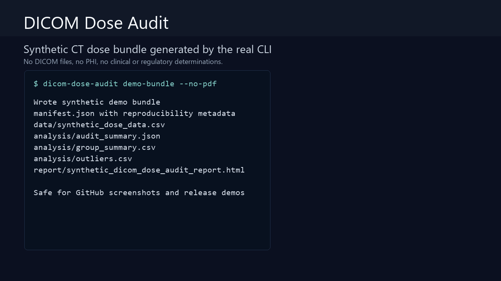

# DICOM Dose Audit

[](https://github.com/AKaturu/dicom-dose-audit/actions/workflows/ci.yml)
[](https://www.python.org/)
[](LICENSE)

Open-source CT radiation-dose audit tool for quality-improvement and research workflows.

`dicom-dose-audit` reads CTDIvol and DLP values from DICOM metadata or dose structured reports, groups studies by protocol, scanner, and patient-size category, detects missing dose metadata, flags statistical outliers, compares protocol versions, plots monthly trends, and generates quality-improvement reports.



> Research and quality-improvement software only. This project is not a medical device, does not diagnose disease, and does not determine regulatory compliance by itself.

## Evidence Status

| Evidence | Status |
|---|---|
| Unit and integration tests | Complete |
| Synthetic end-to-end evaluation | Complete |
| Public-data evaluation | Not completed |
| Independent expert review | Not completed |
| Institutional validation | Not completed |
| Prospective clinical validation | Not completed |

This software is a research prototype and is not intended for independent clinical decision-making.

## Capabilities

- DICOM CT dose extraction with synthetic data support for demos and tests
- Protocol, scanner, and size-category grouping
- Missing-dose metadata summaries
- Outlier detection and protocol-version comparisons
- Monthly trend tables and static/interactive plotting
- HTML report generation for reproducible internal review
- Synthetic demo bundle for screenshots and examples without DICOM privacy risk
- CLI-first design with reusable Python modules
- Streamlit dashboard

## Quick Start

```bash
pip install -e ".[dev]"

# Generate a shareable synthetic report bundle with no DICOM files and no PHI:
dicom-dose-audit demo-bundle --output outputs/synthetic_demo_bundle --no-pdf

# Launch the dashboard:
dicom-dose-audit serve
```

## Limitations

- This project is not a medical device and does not determine regulatory compliance
- Do not commit DICOM files, PHI, or institutional exports
- Run real-data analyses only under appropriate institutional approval
- Generated reports should be reviewed before being shared outside the authorized environment

## Documentation

| Topic | File |
|---|---|
| Product requirements | [docs/REQUIREMENTS.md](docs/REQUIREMENTS.md) |
| Demo media generation | [docs/demo-media.md](docs/demo-media.md) |
| Desktop releases | [docs/DESKTOP_RELEASES.md](docs/DESKTOP_RELEASES.md) |
| Roadmap | [docs/ROADMAP.md](docs/ROADMAP.md) |
| Research notes | [docs/RESEARCH.md](docs/RESEARCH.md) |
| Contribution guide | [CONTRIBUTING.md](CONTRIBUTING.md) |
| Security reporting | [SECURITY.md](SECURITY.md) |

## License

MIT. See [LICENSE](LICENSE).
